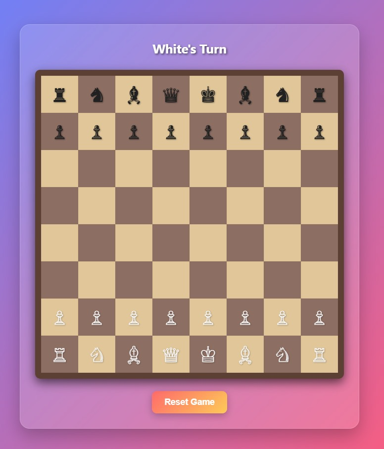

# Interactive Web Chessboard Game

[](https://my-fancy-chessboard.onrender.com)

> A visually enhanced and interactive chessboard game built purely with HTML, CSS, and vanilla JavaScript. Containerized with Docker and deployed live on Render.

---

## ✨ Live Demo ✨

Experience the game live in your browser:

**[➡️ Play Now: https://my-fancy-chessboard.onrender.com](https://my-fancy-chessboard.onrender.com)**

---

## 📖 Description

This project presents a fully functional chessboard interface created using standard web technologies. It includes logic for piece movement validation, turn tracking, check detection, basic checkmate/stalemate conditions, and pawn promotion. The focus was on creating a clean, visually appealing interface with smooth animations and clear indicators for game state, selection, and possible moves.

The entire application is contained within a single `Chessboard.html` file, demonstrating the power of modern CSS and JavaScript. For easy deployment, it's containerized using Docker with an Nginx web server and automatically deployed via Render.com directly from this repository.

---

## 🚀 Features

* **Standard Chess Setup:** Classic 8x8 board with all pieces in their starting positions.
* **Interactive Piece Movement:** Click to select a piece and click again on a valid square to move.
* **Move Highlighting:**
    * Selected piece's square is highlighted.
    * Possible move squares are indicated with subtle pulsing dots.
    * Possible capture squares are indicated with pulsing rings.
* **Valid Move Calculation:** Implements basic movement rules for all standard chess pieces (Pawn, Rook, Knight, Bishop, Queen, King).
* **Check Detection:** Highlights the King's square when it is in check.
* **Move Validation:** Prevents moves that would leave the player's own King in check.
* **Basic Game Over Conditions:** Detects and announces Checkmate and Stalemate scenarios.
* **Pawn Promotion:** Pawns automatically promote to Queens upon reaching the opposite rank.
* **Turn Indication:** Clearly displays whose turn it is ("White's Turn" / "Black's Turn").
* **Responsive Design:** The board scales reasonably well on different screen sizes.
* **Visual Polish:** Uses gradients, animations, and transitions for a smoother user experience.
* **Reset Functionality:** A button to easily restart the game to the initial state.

---

## 🛠️ Technologies Used

* **Frontend:**
    * HTML5
    * CSS3 (Grid Layout, Custom Properties, Gradients, Animations, Transitions, `clamp()` for responsiveness)
    * Vanilla JavaScript (ES6+) (DOM Manipulation, Event Handling, Game Logic)
* **Containerization:**
    * Docker
* **Web Server:**
    * Nginx (via Docker base image)
* **Deployment:**
    * Render.com (Web Service, Docker environment)
* **Version Control:**
    * Git & GitHub

---

## ☁️ Deployment

This application is deployed as a Docker container on Render.com.

* The `Dockerfile` uses the `nginx:stable-alpine` base image.
* It copies the `Chessboard.html` file into the Nginx web root directory as `index.html`.
* Render builds the Docker image directly from this repository's `main` branch and hosts the service.
* Auto-deploy is enabled, so changes pushed to `main` trigger a new deployment.

---

## 💻 Running Locally (Requires Docker)

If you want to run this project on your local machine:

1.  **Prerequisites:** Make sure you have Docker Desktop installed and running.
2.  **Clone the repository:**
    ```bash
    git clone [https://github.com/Owono2001/chessboard-render-deploy.git](https://github.com/Owono2001/chessboard-render-deploy.git)
    cd chessboard-render-deploy
    ```
3.  **Build the Docker image:**
    ```bash
    docker build -t local-chessboard .
    ```
4.  **Run the Docker container:**
    ```bash
    docker run -d -p 8080:80 --name my-local-chessboard local-chessboard
    ```
    *(This maps port 8080 on your machine to port 80 inside the container)*
5.  **Open in browser:** Navigate to `http://localhost:8080`

---
